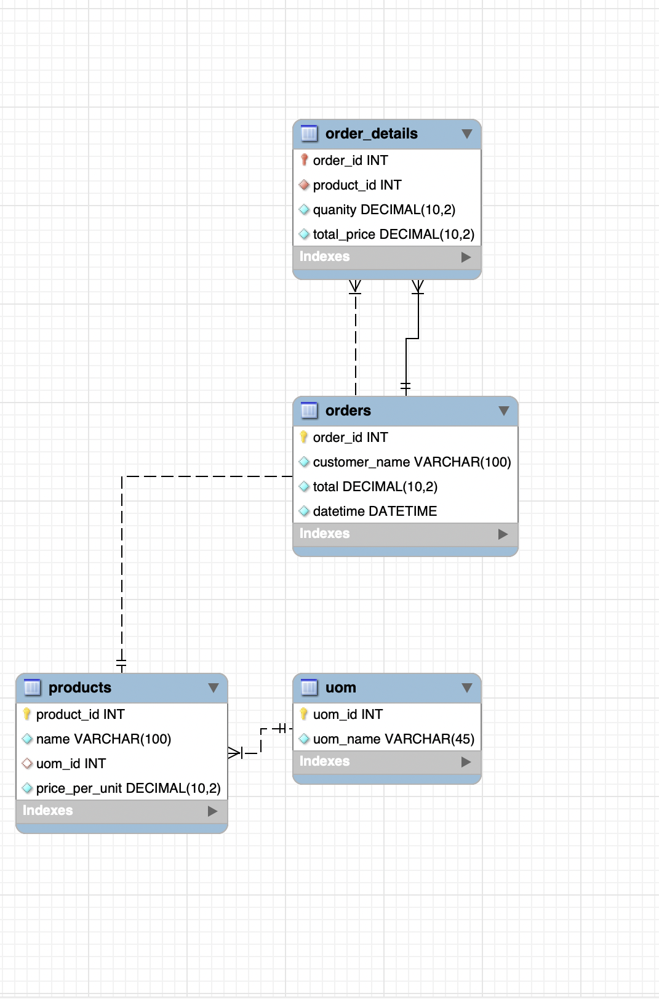

# Grocery Management System

A Python-based grocery store management application designed as a 3-tier system with a front end, backend, and database. This project enables efficient management of products and orders with an intuitive interface and robust backend functionality.

## Table of Contents
- [Features](#features)
- [Technologies Used](#technologies-used)
- [Installation](#installation)
- [Usage](#usage)
- [TODO](#todo)
- [License](#license)

### 1. Index Page

The index page lists all the orders placed with options to view or delete an order.

### 2. Manage Products

The manage products page allows you to add, edit, or delete products.

### 3. Add Product

The manage products page allows you to add a new product.

### 4. New Order Screen

The new order screen with validations for customer name and product details.

### 5. Database schema

Shows how each table is connected

## Features
1. **Product Management**:
   - Add new products with details like name, unit, and price per unit.
   - Edit product details.
   - Delete products from the inventory.

2. **Order Management**:
   - View a list of all orders on the index page with details like total price and order date.
   - Delete orders (sets foreign key to `NULL` in the `order_detail` table but retains records).
   - View detailed information about each order, including products, quantities, and total costs.

3. **New Order Creation**:
   - Place a new order with validations to ensure correct data entry.
   - Client-side validations:
     - Customer name is required.
     - Prevent editing price or total price of products in the order.
     - Enforce sequential product addition before creating new products.
   - 10% discount applied automatically to each product.

4. **Navigation**:
   - **Manage Products**: Redirects to the product management screen.
   - **New Order**: Opens the new order creation screen.

5. **Backend Functionality**:
   - Flask server handles backend logic and exposes HTTPS endpoints.
   - MySQL database integration with a connection pool of size 5 to manage 5 database connections at the same time.

6. **Server Deployment**:
   - Runs locally on port `5000`.
   - Flask development server supports single-threaded execution.

7. **Database Design**:
   - Foreign key constraints ensure data integrity:
     - On order deletion, related `order_detail` records are set to `NULL` (using `SET_NULL`).

## Technologies Used
### Frontend:
- HTML/CSS
- JavaScript
- Bootstrap

### Backend:
- Python (Flask)

### Database:
- MySQL

## Installation
1. Clone the repository:
   ```bash
   git clone https://github.com/Karan19sukhija/GroceryManagementSystem.git
   cd GroceryManagementSystem

2. Set up a virtual environment:
    ```bash
   python -m venv venv
   source venv/bin/activate  # On Windows: venv\Scripts\activate

3. Install MySQL locally. [Download MySQL here](https://dev.mysql.com/downloads/mysql/).

   - Configure the database credentials in the `sql_connection` file.
   - Design a database schema to define the required tables. For this project, we need 4 tables:
     - **products**:
       - `product_id`: Primary key, auto-incremented.
       - `name`: Name of the product.
       - `price_per_quantity`: Price of the product per unit.
       - `uom_id`: Foreign key referencing the `uom` table.
     - **uom** (Unit of Measure):
       - `uom_id`: Primary key.
       - `name`: Name of the unit of measure.
     - **orders**:
       - `order_id`: Primary key.
       - `customer_name`: Name of the customer.
       - `datetime`: Timestamp of the order.
       - `total`: Total cost of the order.
     - **order_details**:
       - `order_id`: Foreign key referencing the `orders` table.
       - `product_id`: Foreign key referencing the `products` table.
       - `quantity`: Quantity of the product in the order.
       - `total_price`: Total price for the product in the order.

4. Install dependencies:
    ```bash
    pip install -r requirements.txt
   
5. Run the Flask server by running server.py file

6. The application will be available at http://localhost:5000.

## Usage
- Launch the application locally by visiting `http://localhost:5000`.
- Navigate through the application using the following options:
  1. **Index Page**: View all existing orders with details such as total cost and order date. Use options to delete or view detailed information about an order.
  2. **Manage Products**: Redirects to the product management screen where you can add, edit, or delete products.
  3. **New Order**: Opens the new order screen to create a new order with built-in front-end validations, such as ensuring customer name is provided and restricting price changes for products.

## TODO
1. **Server-Side Validations**:
   - Add backend validation to enforce constraints and improve security by preventing front-end bypasses.

2. **Cloud Deployment**:
   - Deploy the application to AWS Lambda for scalability and concurrency management.
   - Use AWS API Gateway to expose the application to end users.

3. **Multi-Threading Support**:
   - Integrate a WSGI server like Gunicorn to enable multi-threaded or multi-process execution, improving performance under heavy load.

4. **Enhanced Features**:
   - Add reporting functionality for sales and inventory.
   - Improve UI/UX for better user experience.

